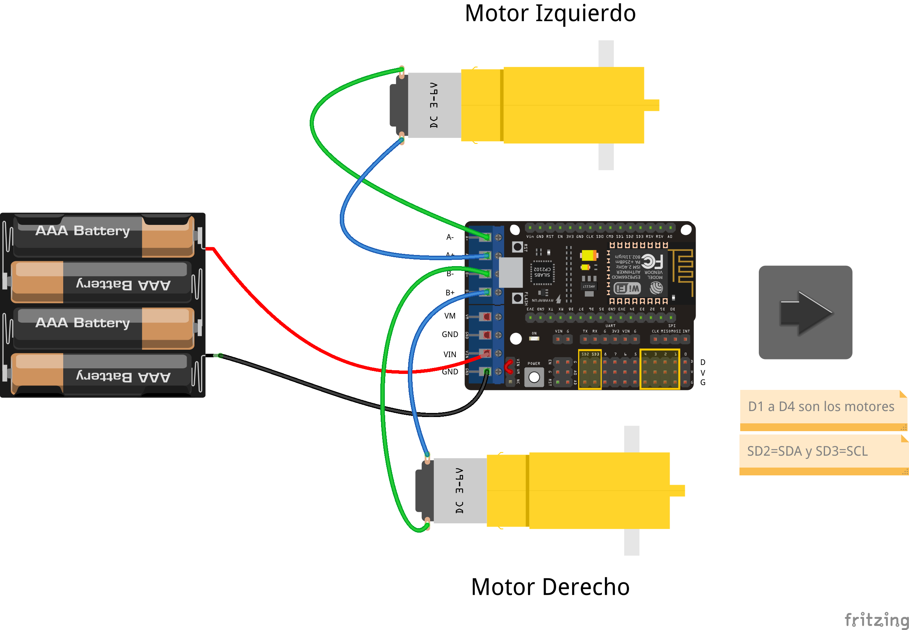
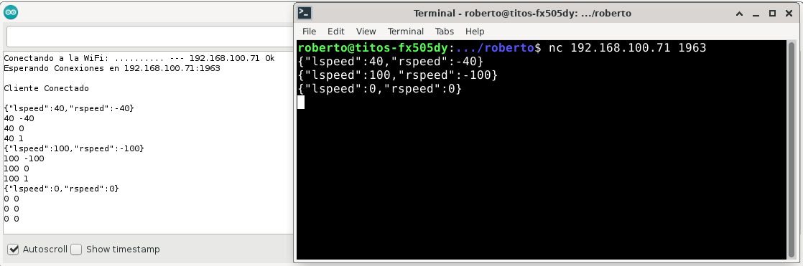
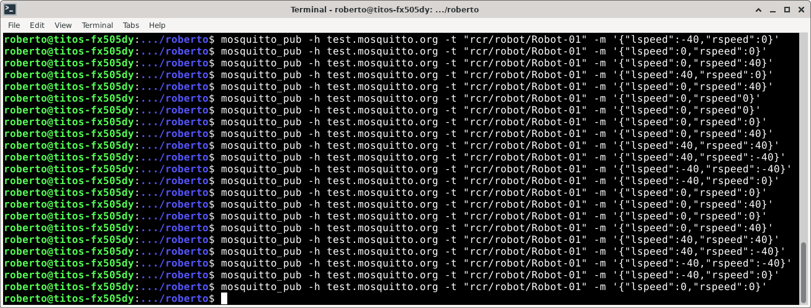

# NodeMCU-Rover-Robot
Robot del tipo rover basado en NodeMCU (ESP8266) y shield de motores

Se suministran 3 firmwares para ser modificados desde la IDE de Arduino:

+ Firmware-Demo/: programación autónoma
+ Firmware-MQTT/: control a través de mensajes JSON vía MQTT
+ Firmware-TCP/: control a través de mensajes JSON vía conexión TCP directa
