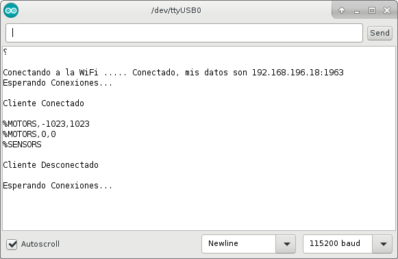
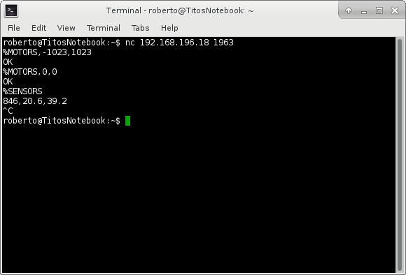
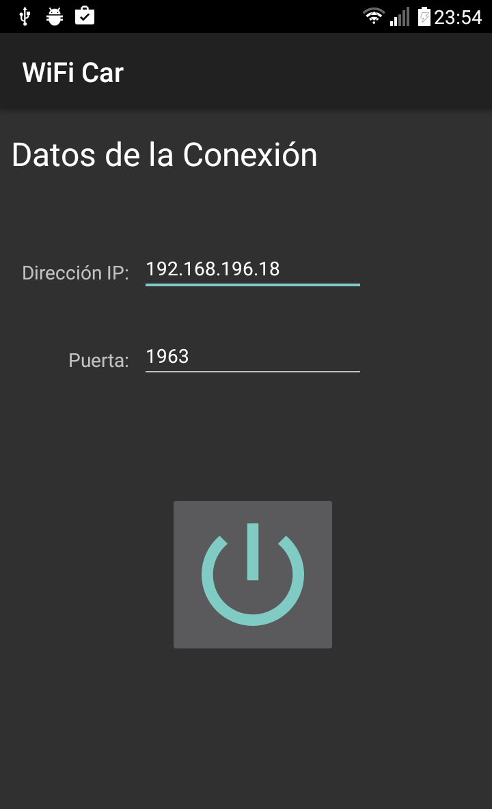
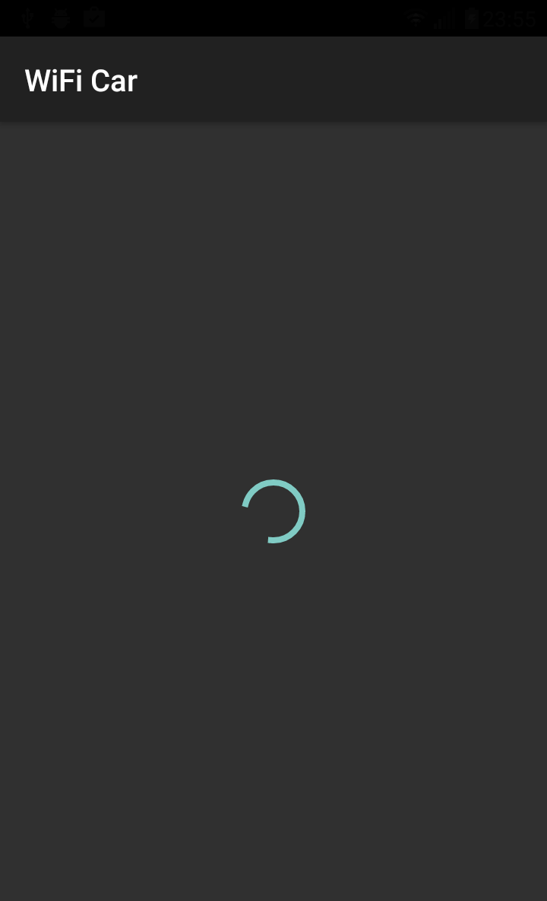
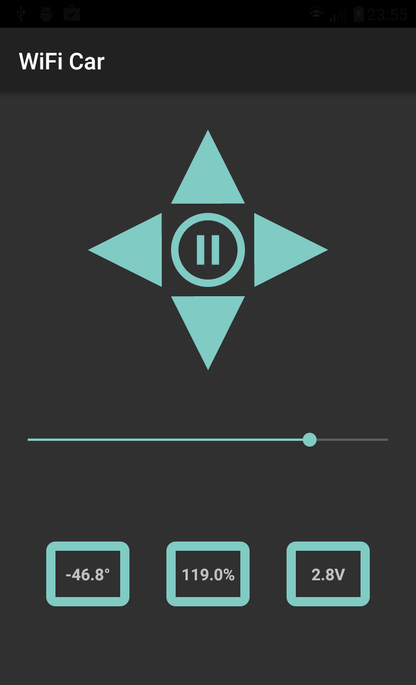

# NodeMCU-Rover-Robot

NodeMCU (ESP8266) rover robot WiFi controlled from Android app or Desktop application

Original code and documentation: [User Manual for WiFi Car by NodeMCU (DoitCar) from ESP8266](https://smartarduino.gitbooks.io/user-manual-for-wifi-car-by-nodemcu-doitcar-/content/)

## My own implementation

  
